<!-- ─────────────────────────────────────────────────────────────────────── -->
<!--  ONYX — NEON ARCADE PROFILE                                           -->
<!-- ─────────────────────────────────────────────────────────────────────── -->

<!-- ─── CHARACTER SHEET ───────────────────────────────────────────────── -->

  

<table>
<tr>
<td width="60%" valign="middle">

</td>
<td width="40%" valign="middle">

**The short version**

I wire advanced models into real, operational
systems — API surfaces that hold up, complex
state that stays honest, and the frontend
craft that makes all of it feel human.

Every repo here is a run I finished.

</td>
</tr>
</table>

  

<!-- ─── SKILL TREE ────────────────────────────────────────────────────── -->

  

    

<table>
  <tr>
    <td align="right"><b>FRONTEND</b> lv.&nbsp;MAX</td>
    <td></td>
  </tr>
  <tr>
    <td align="right"><b>BACKEND</b> lv.&nbsp;MAX</td>
    <td></td>
  </tr>
  <tr>
    <td align="right"><b>AI&nbsp;/&nbsp;ML</b> lv.&nbsp;48</td>
    <td></td>
  </tr>
  <tr>
    <td align="right"><b>DATA</b> lv.&nbsp;42</td>
    <td></td>
  </tr>
  <tr>
    <td align="right"><b>INFRA</b> lv.&nbsp;39</td>
    <td></td>
  </tr>
  <tr>
    <td align="right"><b>GAME&nbsp;/&nbsp;XR</b> lv.&nbsp;31</td>
    <td></td>
  </tr>
  <tr>
    <td align="right"><b>MOBILE</b> lv.&nbsp;27</td>
    <td></td>
  </tr>
</table>

<!-- ─── THE ARCADE ────────────────────────────────────────────────────── -->

  

   
  every commit is a pellet — the snake eats a year of work
    

<picture>
  <source media="(prefers-color-scheme: dark)" srcset="https://raw.githubusercontent.com/onyx766/onyx766/output/snake-dark.svg"/>
  <source media="(prefers-color-scheme: light)" srcset="https://raw.githubusercontent.com/onyx766/onyx766/output/snake.svg"/>
  
</picture>

  

<!-- ─── COMPLETED QUESTS ──────────────────────────────────────────────── -->

  

    

<table>
  <thead>
    <tr>
      <th align="left">Quest</th>
      <th align="left">Loadout</th>
      <th align="center">Rank</th>
    </tr>
  </thead>
  <tbody>
    <tr>
      <td><b>HomeSprint</b> home-buying command center</td>
      <td>Next.js · FastAPI · Tailwind</td>
      <td align="center">S</td>
    </tr>
    <tr>
      <td><b>Sam Intel</b> federal recompete radar</td>
      <td>Next.js · D3 · Supabase</td>
      <td align="center">S</td>
    </tr>
    <tr>
      <td><b>VinylSheetz</b> crate-digger's archive</td>
      <td>React · Tauri · SQLite · MusicBrainz</td>
      <td align="center">A</td>
    </tr>
    <tr>
      <td><b>CodeClash</b> competitive coding arena</td>
      <td>Node · Prisma · WebSockets</td>
      <td align="center">A</td>
    </tr>
    <tr>
      <td><b>Multi-Model AI Chatbot</b> one prompt, many brains</td>
      <td>TypeScript · Streaming APIs</td>
      <td align="center">A</td>
    </tr>
  </tbody>
</table>

<!-- ─── FOOTER ────────────────────────────────────────────────────────── -->

  

